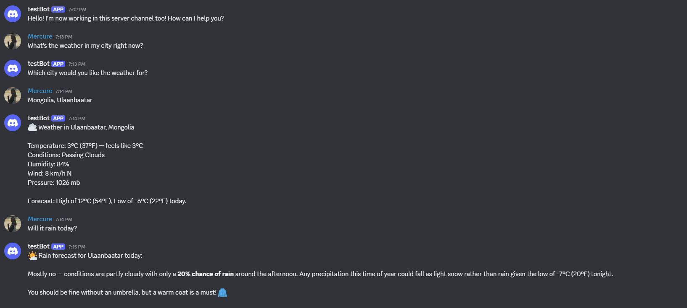
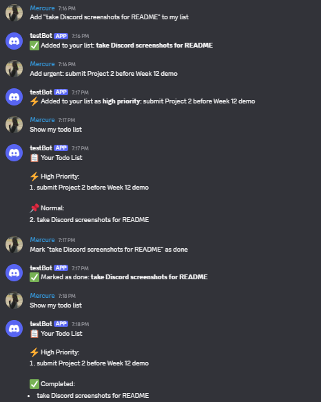
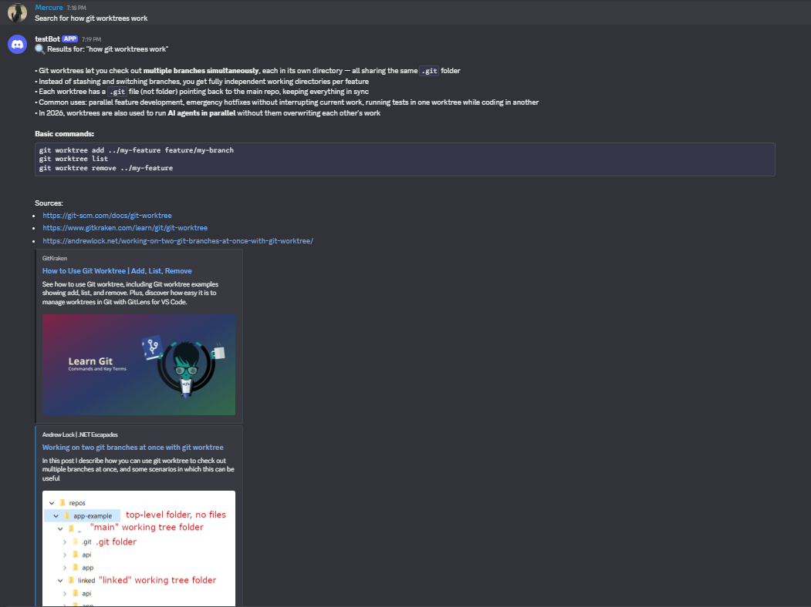
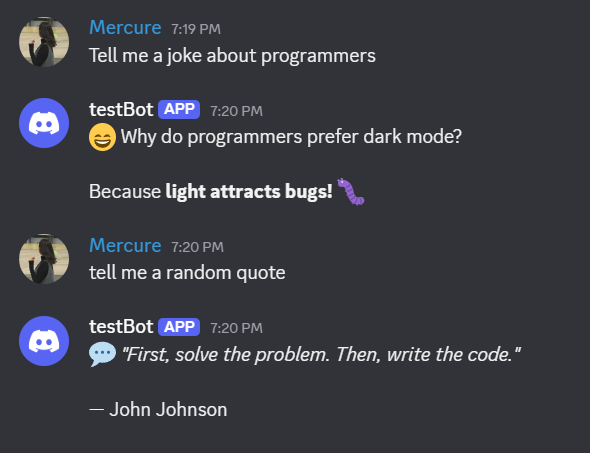
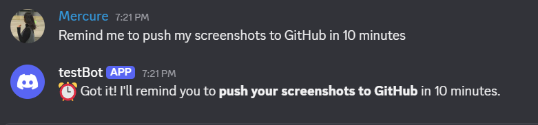
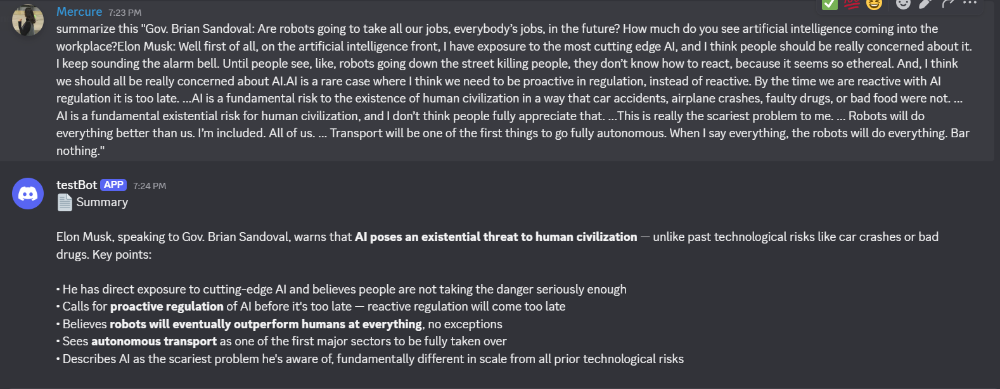

# Personal Discord Bot — Claude Channels

A Discord bot powered by Claude Code (Path A: Claude Channels). Messages sent to the Discord server are routed to Claude Code running locally, which handles requests using a set of custom skills.

## Platform

**Discord** — Connect via the server invite shared during demo.

Claude Code must be running on the host machine during the demo.

---

## Skills

| Skill | Trigger Examples | Description |
|---|---|---|
| `weather` | "What's the weather in Tokyo?" | Current weather for any city |
| `todo` | "Add buy milk to my list" / "Show my todos" | Personal todo list stored locally |
| `web-search` | "Search for latest AI news" | Web search with summarized results |
| `joke-quote` | "Tell me a joke" / "Give me a quote" | Random joke or inspirational quote |
| `reminder` | "Remind me to call John in 30 minutes" | Timed reminder sent back through Discord |
| `file-summarizer` | "Summarize report.txt" | Summarize any local text file |

---

## Example Interactions

**Weather:**
> User: What's the weather in Paris?
> Bot: ☀️ Weather in Paris — Temperature: 22°C (71°F), Conditions: Sunny, Humidity: 45%, Wind: 8 mph W

**Todo:**
> User: Add finish the report to my list
> Bot: Added to your list: finish the report

**Web Search:**
> User: Search for Python 3.13 new features
> Bot: 🔍 Results for "Python 3.13 new features" — [summary + sources]

**Joke:**
> User: Tell me a joke
> Bot: 😄 Why do programmers prefer dark mode? Because light attracts bugs! 🐛

**Reminder:**
> User: Remind me to drink water in 20 minutes
> Bot: Got it! I'll remind you about 'drink water' in 20 minutes.
> *(20 minutes later)* ⏰ Reminder: drink water

**File Summarizer:**
> User: Summarize notes.txt
> Bot: 📄 Summary of notes.txt — [overview + key points]

---

## Setup

### Prerequisites
- [Claude Code](https://claude.ai/code) installed and running
- Discord bot token (from [Discord Developer Portal](https://discord.com/developers))

### Steps

1. **Clone the repo:**
   ```bash
   git clone <repo-url>
   cd "Project 2"
   ```

2. **Configure Claude Channels for Discord:**
   ```bash
   claude channel add discord
   ```
   Enter your bot token when prompted.

3. **Run Claude Code** in this project directory:
   ```bash
   claude
   ```

4. **Invite the bot** to your Discord server using the OAuth2 URL from the Developer Portal (with `bot` scope and `Send Messages` permission).

5. Message the bot in Discord — it will route to Claude Code and respond using the skills.

---

## Git Workflow

- One GitHub issue per skill
- One feature branch per skill
- Worktrees used for parallel development of at least two skills simultaneously

### Branch structure:
```
master
├── feature/weather-skill
├── feature/todo-skill
├── feature/web-search-skill
├── feature/joke-quote-skill
├── feature/reminder-skill
└── feature/file-summarizer-skill
```

### Worktree parallel development:
Weather and todo skills were developed simultaneously using git worktrees:
```bash
git worktree add ../bot-weather feature/weather-skill
git worktree add ../bot-todo feature/todo-skill
# work on both in parallel, then commit independently
```

---

## Screenshots

### Weather


### Todo


### Web Search


### Joke / Quote


### Reminder


### File Summarizer


> Add your own screenshots by saving Discord conversation images to the `screenshots/` folder with the names above.
